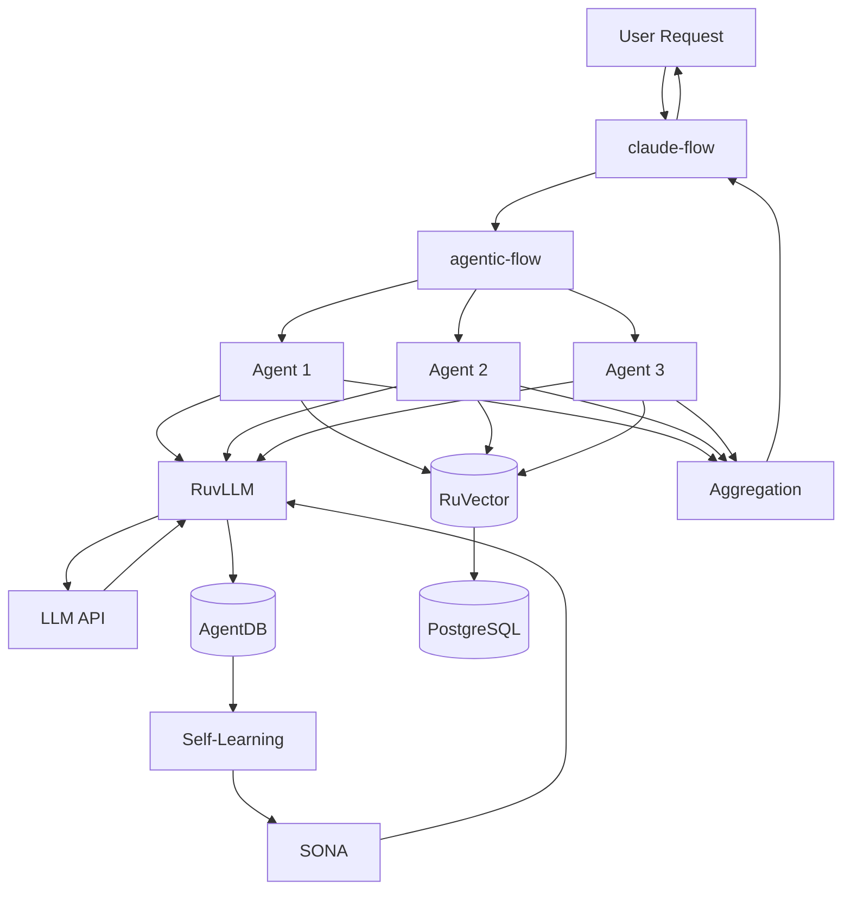

# 🌐 RuvNet Ecosystem - Complete Documentation

> **The Definitive Guide to the RuVector AI Agent Ecosystem**  
> Total Packages: 161 | Last Updated: December 2024

---

## 📑 Table of Contents

- [Executive Summary](#executive-summary)
- [Top Hierarchy Architecture](#top-hierarchy-architecture)
- [System-Wide Data Flows](#system-wide-data-flows)
- [Package Function Flows](#package-function-flows)
- [Complete Package Reference](#complete-package-reference)
- [Deployment Guide](#deployment-guide)
- [Integration Patterns](#integration-patterns)

---

## 🎯 Executive Summary

The RuvNet ecosystem is a comprehensive AI agent orchestration platform built around **claude-flow** as the central coordinator. It provides enterprise-grade infrastructure for building self-improving, multi-agent AI systems with vector storage, LLM inference, and production monitoring.

### Core Value Proposition

- 🚀 **Enterprise Orchestration**: claude-flow coordinates 50+ concurrent agents
- 💾 **High-Performance Storage**: RuVector handles 50k+ vector inserts/sec
- 🧠 **Adaptive Learning**: SONA provides self-optimizing neural architectures
- 📊 **Production Ready**: Built-in monitoring, health checks, and graceful degradation

---

## 🏗️ Top Hierarchy Architecture

### Tier 1: Foundation Layer (Core Dependencies)

These packages form the absolute foundation. Everything else depends on them.

#### 1. **@ruvector/core** ⭐⭐⭐⭐⭐
- **Hierarchy Level**: Layer 0 (Foundation)
- **Purpose**: Core vector operations engine
- **Dependencies**: None (pure foundation)
- **Depended On By**: 42+ packages
- **Function Flow**:
  ```
  Input Vector → Normalization → Index Lookup → Distance Computation → Result Set
  ```
- **Data Flow**:
  ```
  Vector[1536] → HNSW Index → Similarity Scores → Top-K Results
  ```
- **What It Does**: Provides low-level vector operations (insert, query, delete, update) with optimized SIMD instructions for fast similarity search.

#### 2. **ruvector** ⭐⭐⭐⭐⭐
- **Hierarchy Level**: Layer 1 (Storage)
- **Purpose**: High-level vector database
- **Dependencies**: @ruvector/core, @ruvector/postgres-cli (optional)
- **Depended On By**: claude-flow, agentic-flow, agentdb, 30+ others
- **Function Flow**:
  ```
  API Call → Validation → @ruvector/core → Backend Storage → Response
  ```
- **Data Flow**:
  ```
  Application → RuVector API → HNSW Index → PostgreSQL/Memory → Results
  ```
- **What It Does**: Exposes a high-level API for vector storage with multiple backend support (PostgreSQL with pgvector, in-memory, file-based). Handles connection pooling, caching, and query optimization.

#### 3. **agentdb** ⭐⭐⭐⭐⭐
- **Hierarchy Level**: Layer 1 (State Management)
- **Purpose**: Agent state persistence and memory
- **Dependencies**: ruvector
- **Depended On By**: claude-flow, agentic-flow, all agent systems
- **Function Flow**:
  ```
  Agent Event → State Serialization → RuVector Storage → Memory Retrieval
  ```
- **Data Flow**:
  ```
  Agent State → JSON Serialization → Vector Embedding → RuVector → Query Results
  ```
- **What It Does**: Manages agent lifecycle, stores execution traces, implements causality tracking, reflexion memory, and skill library. Provides semantic search over agent history.

### Tier 2: Intelligence Layer (LLM & Learning)

#### 4. **@ruvector/ruvllm** ⭐⭐⭐⭐
- **Hierarchy Level**: Layer 2 (Inference)
- **Purpose**: LLM inference orchestration
- **Dependencies**: @ruvector/core, agentdb
- **Depended On By**: claude-flow, @ruvector/sona, @foxruv/iris
- **Function Flow**:
  ```
  Prompt → Model Selection → API Call → Response Streaming → Cache Update
  ```
- **Data Flow**:
  ```
  User Prompt → LLM API → Token Stream → AgentDB Cache → Response
  ```
- **What It Does**: Unified interface for multiple LLM providers (OpenAI, Anthropic, Azure). Implements Temporal Recursive Memory (TRM) for context management, response caching, and batch processing.

#### 5. **@ruvector/sona** ⭐⭐⭐⭐
- **Hierarchy Level**: Layer 3 (Adaptive Learning)
- **Purpose**: Self-Optimizing Neural Architecture
- **Dependencies**: @ruvector/ruvllm, agentdb
- **Depended On By**: claude-flow, @foxruv/iris
- **Function Flow**:
  ```
  Execution Trace → Performance Analysis → LoRA Update → Model Weights
  ```
- **Data Flow**:
  ```
  Training Data → Elastic Weight Consolidation → LoRA Layers → Updated Model
  ```
- **What It Does**: Continuously learns from agent execution patterns. Uses Low-Rank Adaptation (LoRA) to update model weights without full retraining. Implements Elastic Weight Consolidation (EWC) to prevent catastrophic forgetting.

#### 6. **@foxruv/iris** ⭐⭐⭐
- **Hierarchy Level**: Layer 3 (Monitoring)
- **Purpose**: LLM drift detection and optimization
- **Dependencies**: @ruvector/ruvllm, @ruvector/sona
- **Depended On By**: claude-flow (optional)
- **Function Flow**:
  ```
  Model Outputs → Drift Detection → Alert/Retrain → Updated Weights
  ```
- **Data Flow**:
  ```
  Performance Metrics → Statistical Analysis → Retraining Trigger → SONA
  ```
- **What It Does**: Monitors LLM performance over time, detects distribution drift, triggers automatic retraining, and validates model improvements.

### Tier 3: Orchestration Layer (Agent Coordination)

#### 7. **agentic-flow** ⭐⭐⭐⭐⭐
- **Hierarchy Level**: Layer 2 (Agent Management)
- **Purpose**: Agent lifecycle orchestration
- **Dependencies**: agentdb, ruvector
- **Depended On By**: claude-flow, research-swarm, agentic-jujutsu
- **Function Flow**:
  ```
  Spawn Request → Agent Creation → Health Monitoring → Termination
  ```
- **Data Flow**:
  ```
  Task → Agent Pool → Work Queue → Execution → Results → AgentDB
  ```
- **What It Does**: Manages the complete lifecycle of 50+ concurrent agents. Handles spawning, health checks, supervision (hierarchical/flat/peer), graceful shutdown, and crash recovery. Implements resource throttling and priority queuing.

#### 8. **claude-flow** ⭐⭐⭐⭐⭐
- **Hierarchy Level**: Layer 4 (Top-Level Orchestrator)
- **Purpose**: Enterprise multi-agent orchestration
- **Dependencies**: agentic-flow, agentdb, ruvector, @ruvector/ruvllm
- **Depended On By**: End applications
- **Function Flow**:
  ```
  User Task → Workflow Planning → Agent Allocation → Execution → Aggregation
  ```
- **Data Flow**:
  ```
  HTTP Request → Claude-Flow → Agentic-Flow → Agents → RuVector → Response
  ```
- **What It Does**: Top-level coordinator that breaks down complex tasks into agent workflows. Integrates ReasoningBank for long-term memory, MCP servers for tool access, and provides REST API for external access. Handles workflow orchestration, result aggregation, and monitoring.

#### 9. **research-swarm** ⭐⭐⭐
- **Hierarchy Level**: Layer 3 (Specialized Orchestrator)
- **Purpose**: Multi-agent research coordination
- **Dependencies**: agentic-flow, agentdb, ruvector
- **Depended On By**: End applications
- **Function Flow**:
  ```
  Research Query → Agent Swarm → Parallel Research → Synthesis → Report
  ```
- **Data Flow**:
  ```
  Topic → 10+ Research Agents → Web/DB Queries → Knowledge Graph → Report
  ```
- **What It Does**: Coordinates 10+ research agents for comprehensive topic analysis. Implements GOAP (Goal-Oriented Action Planning), multi-perspective analysis, and long-horizon planning. Produces structured research reports with citations.

#### 10. **agentic-jujutsu** ⭐⭐⭐
- **Hierarchy Level**: Layer 3 (Coordination)
- **Purpose**: Multi-agent conflict resolution
- **Dependencies**: agentic-flow, agentdb
- **Depended On By**: claude-flow
- **Function Flow**:
  ```
  Conflict Detection → Priority Analysis → Resource Arbitration → Resolution
  ```
- **Data Flow**:
  ```
  Multiple Agent Requests → Consensus Algorithm → Resource Allocation
  ```
- **What It Does**: Resolves conflicts when multiple agents compete for resources. Implements quantum-DAG consensus, priority-based arbitration, and resource scheduling. Ensures fair resource distribution and prevents deadlocks.

### Tier 4: Self-Learning Layer

#### 11. **@agentic-robotics/self-learning** ⭐⭐⭐
- **Hierarchy Level**: Layer 3 (Optimization)
- **Purpose**: Reinforcement learning for agents
- **Dependencies**: agentdb, ruvector
- **Depended On By**: claude-flow, agentic-flow
- **Function Flow**:
  ```
  Execution Traces → Pattern Mining → Optimization → Policy Update
  ```
- **Data Flow**:
  ```
  AgentDB Traces → PSO/NSGA-II → Learned Patterns → SONA → Improved Agents
  ```
- **What It Does**: Analyzes agent execution traces to discover optimization patterns. Implements Particle Swarm Optimization (PSO), NSGA-II evolutionary algorithms, and swarm intelligence. Continuously improves agent performance through reinforcement learning.

#### 12. **agent-booster** ⭐⭐⭐
- **Hierarchy Level**: Layer 3 (Caching)
- **Purpose**: Ultra-fast agent optimization
- **Dependencies**: agentdb
- **Depended On By**: claude-flow
- **Function Flow**:
  ```
  Query → Cache Lookup → Fast Response OR Execute → Cache Update
  ```
- **Data Flow**:
  ```
  Agent Request → Intelligent Cache → 52x Faster Response
  ```
- **What It Does**: Provides aggressive caching and optimization for agent execution. Claims 52x speedup over baseline through intelligent cache invalidation, result memoization, and execution path optimization.

---

## 🔄 System-Wide Data Flows

### Primary Data Flow (User Request → Response)



### Learning Feedback Loop

```
Execution → AgentDB → Self-Learning → Pattern Discovery → SONA → Model Update → Improved Execution
```

### Knowledge Storage Flow

```
Embedding Generation → RuVector → HNSW Index → PostgreSQL → Similarity Search → Context Retrieval
```

---

## 📦 Package Function Flows (In-Depth)


### @agentic-robotics/cli

**Version**: 0.2.3  
**Category**: Specialized
**Hierarchy**: Application Layer

**Description**: CLI tools for agentic robotics framework

**Installation**: `npm install @agentic-robotics/cli`  
**CLI Usage**: `npx @agentic-robotics/cli [command] [options]`


---

### @agentic-robotics/core

**Version**: 0.2.1  
**Category**: Specialized
**Hierarchy**: Application Layer

**Description**: High-performance agentic robotics framework - Core bindings

**Installation**: `npm install @agentic-robotics/core`  
**Module Usage**: `require('@agentic-robotics/core')`


---

### @agentic-robotics/linux-x64-gnu

**Version**: 0.2.0  
**Category**: Specialized
**Hierarchy**: Application Layer

**Description**: agentic-robotics native bindings for Linux x64 (GNU)

**Installation**: `npm install @agentic-robotics/linux-x64-gnu`  
**Module Usage**: `require('@agentic-robotics/linux-x64-gnu')`


---

### @agentic-robotics/mcp

**Version**: 0.2.2  
**Category**: MCP Server
**Hierarchy**: Tool Layer

**Description**: Model Context Protocol server for agentic robotics with AgentDB integration

**Installation**: `npm install @agentic-robotics/mcp`  
**Module Usage**: `require('@agentic-robotics/mcp')`

**Function Flow**:
```
MCP Request → Tool Selection → Execution → Response Formatting
```

**Data Flow**:
```
JSON-RPC → Tool Handler → External Service → JSON Response
```


---

### @agentic-robotics/self-learning

**Version**: 1.0.0  
**Category**: Self-Learning
**Hierarchy**: Layer 3 (Optimization)

**Description**: AI-powered self-learning optimization system with swarm intelligence, PSO, NSGA-II, evolutionary algorithms for autonomous robotics, multi-agent systems, and continuous learning

**Installation**: `npm install @agentic-robotics/self-learning`  
**Module Usage**: `require('@agentic-robotics/self-learning')`


---

### @agentics.org/agentic-mcp

**Version**: 1.0.4  
**Category**: MCP Server
**Hierarchy**: Tool Layer

**Description**: Agentic MCP Server with advanced AI capabilities including web search, summarization, database querying, and customer support. Built by the Agentics Foundation to enhance AI agents with powerful tools for research, content generation, and data analysis.

**Installation**: `npm install @agentics.org/agentic-mcp`  
**Module Usage**: `require('@agentics.org/agentic-mcp')`

**Function Flow**:
```
MCP Request → Tool Selection → Execution → Response Formatting
```

**Data Flow**:
```
JSON-RPC → Tool Handler → External Service → JSON Response
```


---

### @agentics.org/sparc2

**Version**: 2.0.25  
**Category**: MCP Server
**Hierarchy**: Tool Layer

**Description**: SPARC 2.0 - Autonomous Vector Coding Agent + MCP. SPARC 2.0, vectorized AI code analysis, is an intelligent coding agent framework built to automate and streamline software development. It combines secure execution environments, and version control into a

**Installation**: `npm install @agentics.org/sparc2`  
**Module Usage**: `require('@agentics.org/sparc2')`


---

### @foxruv/e2b-runner

**Version**: 2.0.1  
**Category**: Specialized
**Hierarchy**: Application Layer

**Description**: Production-grade E2B sandbox orchestration with agentic-flow swarms and AgentDB caching for distributed AI agent execution

**Installation**: `npm install @foxruv/e2b-runner`  
**Module Usage**: `require('@foxruv/e2b-runner')`


---

### @foxruv/iris

**Version**: 1.8.19  
**Category**: LLM Intelligence
**Hierarchy**: Layer 2-3 (Intelligence)

**Description**: AI-guided LLM optimization. Install → Tell Claude 'Read .claude/agents/iris.md' → Claude becomes your optimization guide. DSPy prompts, Ax hyperparameters, local LLMs, federated learning. You talk, Iris handles the rest.

**Installation**: `npm install @foxruv/iris`  
**Module Usage**: `require('@foxruv/iris')`


---

### @foxruv/iris-agentic-synth

**Version**: 1.0.5  
**Category**: LLM Intelligence
**Hierarchy**: Layer 2-3 (Intelligence)

**Description**: ⚡ High-performance synthetic prompt generation with genetic evolution, streaming, and multi-model routing. 90%+ cache hit rate, <15ms P99 latency, no Redis required.

**Installation**: `npm install @foxruv/iris-agentic-synth`  
**Module Usage**: `require('@foxruv/iris-agentic-synth')`


---

### @foxruv/iris-core

**Version**: 1.0.0  
**Category**: LLM Intelligence
**Hierarchy**: Layer 2-3 (Intelligence)

**Description**: Intelligent AI orchestration with multi-provider LM management, drift detection, auto-retraining, and performance tracking for production AI systems

**Installation**: `npm install @foxruv/iris-core`  
**Module Usage**: `require('@foxruv/iris-core')`


---

### @foxruv/iris-ultrathink

**Version**: 1.0.0  
**Category**: LLM Intelligence
**Hierarchy**: Layer 2-3 (Intelligence)

**Description**: Standalone MCP server with agentic-flow and agentdb integration

**Installation**: `npm install @foxruv/iris-ultrathink`  
**Module Usage**: `require('@foxruv/iris-ultrathink')`


---

### @foxruv/nova-medicina

**Version**: 1.0.0  
**Category**: Specialized
**Hierarchy**: Application Layer

**Description**: AI-powered medical analysis system with anti-hallucination safeguards - supplement to professional healthcare

**Installation**: `npm install @foxruv/nova-medicina`  
**Module Usage**: `require('@foxruv/nova-medicina')`


---

### @neural-trader/agentic-accounting-agents

**Version**: 0.1.1  
**Category**: Neural Trading
**Hierarchy**: Application Layer

**Description**: Multi-agent swarm orchestration for autonomous accounting operations with ReasoningBank self-learning, distributed task coordination, and intelligent compliance automation for cryptocurrency trading

**Installation**: `npm install @neural-trader/agentic-accounting-agents`  
**Module Usage**: `require('@neural-trader/agentic-accounting-agents')`

**Function Flow**:
```
Market Data → Signal Generation → Risk Check → Order Execution
```

**Data Flow**:
```
Price Feed → Indicators → Trading Signal → Broker API
```


---

### @neural-trader/agentic-accounting-cli

**Version**: 0.1.1  
**Category**: Neural Trading
**Hierarchy**: Application Layer

**Description**: Command-line interface for neural-trader's agentic accounting system with interactive tax calculators, transaction management, compliance reports, and cryptocurrency accounting automation

**Installation**: `npm install @neural-trader/agentic-accounting-cli`  
**CLI Usage**: `npx @neural-trader/agentic-accounting-cli [command] [options]`

**Function Flow**:
```
Market Data → Signal Generation → Risk Check → Order Execution
```

**Data Flow**:
```
Price Feed → Indicators → Trading Signal → Broker API
```


---

### @neural-trader/agentic-accounting-core

**Version**: 0.1.1  
**Category**: Neural Trading
**Hierarchy**: Application Layer

**Description**: Core TypeScript library for autonomous cryptocurrency accounting with transaction management, compliance automation, fraud detection, and AgentDB-powered vector search for intelligent financial analysis

**Installation**: `npm install @neural-trader/agentic-accounting-core`  
**Module Usage**: `require('@neural-trader/agentic-accounting-core')`

**Function Flow**:
```
Market Data → Signal Generation → Risk Check → Order Execution
```

**Data Flow**:
```
Price Feed → Indicators → Trading Signal → Broker API
```


---

### @neural-trader/agentic-accounting-mcp

**Version**: 0.1.1  
**Category**: Neural Trading
**Hierarchy**: Application Layer

**Description**: Model Context Protocol (MCP) server for Claude Desktop integration, exposing intelligent accounting tools, tax calculators, and autonomous agents for AI-powered cryptocurrency financial analysis

**Installation**: `npm install @neural-trader/agentic-accounting-mcp`  
**Module Usage**: `require('@neural-trader/agentic-accounting-mcp')`

**Function Flow**:
```
MCP Request → Tool Selection → Execution → Response Formatting
```

**Data Flow**:
```
JSON-RPC → Tool Handler → External Service → JSON Response
```


---

### @neural-trader/agentic-accounting-rust-core

**Version**: 0.1.1  
**Category**: Neural Trading
**Hierarchy**: Application Layer

**Description**: High-performance Rust native addon (NAPI) for cryptocurrency tax calculations with FIFO, LIFO, HIFO cost basis methods and optimized transaction processing for neural-trader accounting system

**Installation**: `npm install @neural-trader/agentic-accounting-rust-core`  
**Module Usage**: `require('@neural-trader/agentic-accounting-rust-core')`

**Function Flow**:
```
Market Data → Signal Generation → Risk Check → Order Execution
```

**Data Flow**:
```
Price Feed → Indicators → Trading Signal → Broker API
```


---

### @neural-trader/agentic-accounting-types

**Version**: 0.1.1  
**Category**: Neural Trading
**Hierarchy**: Application Layer

**Description**: Comprehensive TypeScript type definitions and interfaces for neural-trader's agentic accounting system with cryptocurrency tax calculations, cost basis tracking, and capital gains reporting

**Installation**: `npm install @neural-trader/agentic-accounting-types`  
**Module Usage**: `require('@neural-trader/agentic-accounting-types')`

**Function Flow**:
```
Market Data → Signal Generation → Risk Check → Order Execution
```

**Data Flow**:
```
Price Feed → Indicators → Trading Signal → Broker API
```


---

### @neural-trader/backend

**Version**: 2.2.1  
**Category**: Neural Trading
**Hierarchy**: Application Layer

**Description**: High-performance Neural Trader backend with native Rust bindings via NAPI-RS

**Installation**: `npm install @neural-trader/backend`  
**Module Usage**: `require('@neural-trader/backend')`

**Function Flow**:
```
Market Data → Signal Generation → Risk Check → Order Execution
```

**Data Flow**:
```
Price Feed → Indicators → Trading Signal → Broker API
```


---

### @neural-trader/backtesting

**Version**: 2.6.0  
**Category**: Neural Trading
**Hierarchy**: Application Layer

**Description**: Neural Trader backtesting engine and historical simulation

**Installation**: `npm install @neural-trader/backtesting`  
**Module Usage**: `require('@neural-trader/backtesting')`

**Function Flow**:
```
Market Data → Signal Generation → Risk Check → Order Execution
```

**Data Flow**:
```
Price Feed → Indicators → Trading Signal → Broker API
```


---

### @neural-trader/benchoptimizer

**Version**: 2.1.1  
**Category**: Neural Trading
**Hierarchy**: Application Layer

**Description**: Comprehensive benchmarking, validation, and optimization tool for neural-trader packages

**Installation**: `npm install @neural-trader/benchoptimizer`  
**Module Usage**: `require('@neural-trader/benchoptimizer')`

**Function Flow**:
```
Market Data → Signal Generation → Risk Check → Order Execution
```

**Data Flow**:
```
Price Feed → Indicators → Trading Signal → Broker API
```


---

### @neural-trader/brokers

**Version**: 2.1.1  
**Category**: Neural Trading
**Hierarchy**: Application Layer

**Description**: Broker integrations for Neural Trader - Alpaca, Interactive Brokers, TD Ameritrade

**Installation**: `npm install @neural-trader/brokers`  
**Module Usage**: `require('@neural-trader/brokers')`

**Function Flow**:
```
Market Data → Signal Generation → Risk Check → Order Execution
```

**Data Flow**:
```
Price Feed → Indicators → Trading Signal → Broker API
```


---

### @neural-trader/core

**Version**: 2.0.0  
**Category**: Neural Trading
**Hierarchy**: Application Layer

**Description**: Ultra-low latency neural trading engine with Rust + Node.js bindings

**Installation**: `npm install @neural-trader/core`  
**Module Usage**: `require('@neural-trader/core')`

**Function Flow**:
```
Market Data → Signal Generation → Risk Check → Order Execution
```

**Data Flow**:
```
Price Feed → Indicators → Trading Signal → Broker API
```


---

### @neural-trader/e2b-strategies

**Version**: 1.1.1  
**Category**: Neural Trading
**Hierarchy**: Application Layer

**Description**: Production-ready E2B sandbox trading strategies with 10-50x performance improvements, circuit breakers, and comprehensive observability

**Installation**: `npm install @neural-trader/e2b-strategies`  
**Module Usage**: `require('@neural-trader/e2b-strategies')`

**Function Flow**:
```
Market Data → Signal Generation → Risk Check → Order Execution
```

**Data Flow**:
```
Price Feed → Indicators → Trading Signal → Broker API
```


---

### @neural-trader/example-dynamic-pricing

**Version**: 1.0.0  
**Category**: Neural Trading
**Hierarchy**: Application Layer

**Description**: Self-learning dynamic pricing with RL optimization and swarm strategy exploration

**Installation**: `npm install @neural-trader/example-dynamic-pricing`  
**Module Usage**: `require('@neural-trader/example-dynamic-pricing')`

**Function Flow**:
```
Market Data → Signal Generation → Risk Check → Order Execution
```

**Data Flow**:
```
Price Feed → Indicators → Trading Signal → Broker API
```


---

### @neural-trader/example-energy-forecasting

**Version**: 1.0.0  
**Category**: Neural Trading
**Hierarchy**: Application Layer

**Description**: Self-learning energy forecasting with conformal prediction and swarm-based ensemble models

**Installation**: `npm install @neural-trader/example-energy-forecasting`  
**Module Usage**: `require('@neural-trader/example-energy-forecasting')`

**Function Flow**:
```
Market Data → Signal Generation → Risk Check → Order Execution
```

**Data Flow**:
```
Price Feed → Indicators → Trading Signal → Broker API
```


---

### @neural-trader/example-energy-grid-optimization

**Version**: 0.1.0  
**Category**: Neural Trading
**Hierarchy**: Application Layer

**Description**: Self-learning energy grid optimization with load forecasting, unit commitment, and swarm scheduling

**Installation**: `npm install @neural-trader/example-energy-grid-optimization`  
**Module Usage**: `require('@neural-trader/example-energy-grid-optimization')`

**Function Flow**:
```
Market Data → Signal Generation → Risk Check → Order Execution
```

**Data Flow**:
```
Price Feed → Indicators → Trading Signal → Broker API
```


---

### @neural-trader/example-evolutionary-game-theory

**Version**: 1.0.0  
**Category**: Neural Trading
**Hierarchy**: Application Layer

**Description**: Self-learning evolutionary game theory with multi-agent tournaments, replicator dynamics, and ESS calculation

**Installation**: `npm install @neural-trader/example-evolutionary-game-theory`  
**Module Usage**: `require('@neural-trader/example-evolutionary-game-theory')`

**Function Flow**:
```
Market Data → Signal Generation → Risk Check → Order Execution
```

**Data Flow**:
```
Price Feed → Indicators → Trading Signal → Broker API
```


---

### @neural-trader/example-healthcare-optimization

**Version**: 1.0.0  
**Category**: Neural Trading
**Hierarchy**: Application Layer

**Description**: Healthcare optimization with self-learning patient forecasting and swarm-based staff scheduling

**Installation**: `npm install @neural-trader/example-healthcare-optimization`  
**Module Usage**: `require('@neural-trader/example-healthcare-optimization')`

**Function Flow**:
```
Market Data → Signal Generation → Risk Check → Order Execution
```

**Data Flow**:
```
Price Feed → Indicators → Trading Signal → Broker API
```


---

### @neural-trader/example-logistics-optimization

**Version**: 1.0.0  
**Category**: Neural Trading
**Hierarchy**: Application Layer

**Description**: Self-learning vehicle routing optimization with multi-agent swarm coordination

**Installation**: `npm install @neural-trader/example-logistics-optimization`  
**Module Usage**: `require('@neural-trader/example-logistics-optimization')`

**Function Flow**:
```
Market Data → Signal Generation → Risk Check → Order Execution
```

**Data Flow**:
```
Price Feed → Indicators → Trading Signal → Broker API
```


---

### @neural-trader/example-market-microstructure

**Version**: 1.0.0  
**Category**: Neural Trading
**Hierarchy**: Application Layer

**Description**: Self-learning market microstructure analysis with AI-powered order book prediction, swarm-based feature engineering, and real-time liquidity optimization for trading systems

**Installation**: `npm install @neural-trader/example-market-microstructure`  
**Module Usage**: `require('@neural-trader/example-market-microstructure')`

**Function Flow**:
```
Market Data → Signal Generation → Risk Check → Order Execution
```

**Data Flow**:
```
Price Feed → Indicators → Trading Signal → Broker API
```


---

### @neural-trader/example-neuromorphic-computing

**Version**: 1.0.0  
**Category**: Neural Trading
**Hierarchy**: Application Layer

**Description**: Neuromorphic computing with Spiking Neural Networks, STDP learning, and reservoir computing for ultra-low-power ML

**Installation**: `npm install @neural-trader/example-neuromorphic-computing`  
**Module Usage**: `require('@neural-trader/example-neuromorphic-computing')`

**Function Flow**:
```
Market Data → Signal Generation → Risk Check → Order Execution
```

**Data Flow**:
```
Price Feed → Indicators → Trading Signal → Broker API
```


---

### @neural-trader/example-portfolio-optimization

**Version**: 1.0.0  
**Category**: Neural Trading
**Hierarchy**: Application Layer

**Description**: Self-learning portfolio optimization with benchmark swarms and multi-objective optimization

**Installation**: `npm install @neural-trader/example-portfolio-optimization`  
**Module Usage**: `require('@neural-trader/example-portfolio-optimization')`

**Function Flow**:
```
Market Data → Signal Generation → Risk Check → Order Execution
```

**Data Flow**:
```
Price Feed → Indicators → Trading Signal → Broker API
```


---

### @neural-trader/example-quantum-optimization

**Version**: 1.0.0  
**Category**: Neural Trading
**Hierarchy**: Application Layer

**Description**: Quantum-inspired optimization algorithms with swarm-based circuit exploration for combinatorial and constraint problems

**Installation**: `npm install @neural-trader/example-quantum-optimization`  
**Module Usage**: `require('@neural-trader/example-quantum-optimization')`

**Function Flow**:
```
Market Data → Signal Generation → Risk Check → Order Execution
```

**Data Flow**:
```
Price Feed → Indicators → Trading Signal → Broker API
```


---

### @neural-trader/example-supply-chain-prediction

**Version**: 1.0.0  
**Category**: Neural Trading
**Hierarchy**: Application Layer

**Description**: Self-learning demand forecasting and swarm-based inventory optimization with uncertainty quantification

**Installation**: `npm install @neural-trader/example-supply-chain-prediction`  
**Module Usage**: `require('@neural-trader/example-supply-chain-prediction')`

**Function Flow**:
```
Market Data → Signal Generation → Risk Check → Order Execution
```

**Data Flow**:
```
Price Feed → Indicators → Trading Signal → Broker API
```


---

### @neural-trader/execution

**Version**: 2.6.0  
**Category**: Neural Trading
**Hierarchy**: Application Layer

**Description**: Neural Trader trade execution and order management

**Installation**: `npm install @neural-trader/execution`  
**Module Usage**: `require('@neural-trader/execution')`

**Function Flow**:
```
Market Data → Signal Generation → Risk Check → Order Execution
```

**Data Flow**:
```
Price Feed → Indicators → Trading Signal → Broker API
```


---

### @neural-trader/features

**Version**: 2.1.2  
**Category**: Neural Trading
**Hierarchy**: Application Layer

**Description**: Technical indicators for Neural Trader - SMA, RSI, MACD, Bollinger Bands, and 150+ indicators

**Installation**: `npm install @neural-trader/features`  
**Module Usage**: `require('@neural-trader/features')`

**Function Flow**:
```
Market Data → Signal Generation → Risk Check → Order Execution
```

**Data Flow**:
```
Price Feed → Indicators → Trading Signal → Broker API
```


---

### @neural-trader/market-data

**Version**: 2.1.1  
**Category**: Neural Trading
**Hierarchy**: Application Layer

**Description**: Market data providers for Neural Trader - Alpaca, Polygon, Yahoo Finance

**Installation**: `npm install @neural-trader/market-data`  
**Module Usage**: `require('@neural-trader/market-data')`

**Function Flow**:
```
Market Data → Signal Generation → Risk Check → Order Execution
```

**Data Flow**:
```
Price Feed → Indicators → Trading Signal → Broker API
```


---

### @neural-trader/mcp

**Version**: 2.1.0  
**Category**: Neural Trading
**Hierarchy**: Application Layer

**Description**: Model Context Protocol (MCP) server for Neural Trader with 87+ trading tools

**Installation**: `npm install @neural-trader/mcp`  
**Module Usage**: `require('@neural-trader/mcp')`

**Function Flow**:
```
MCP Request → Tool Selection → Execution → Response Formatting
```

**Data Flow**:
```
JSON-RPC → Tool Handler → External Service → JSON Response
```


---

### @neural-trader/mcp-protocol

**Version**: 2.0.0  
**Category**: Neural Trading
**Hierarchy**: Application Layer

**Description**: Model Context Protocol (MCP) JSON-RPC 2.0 protocol types for Neural Trader

**Installation**: `npm install @neural-trader/mcp-protocol`  
**Module Usage**: `require('@neural-trader/mcp-protocol')`

**Function Flow**:
```
MCP Request → Tool Selection → Execution → Response Formatting
```

**Data Flow**:
```
JSON-RPC → Tool Handler → External Service → JSON Response
```


---

### @neural-trader/neural

**Version**: 2.6.0  
**Category**: Neural Trading
**Hierarchy**: Application Layer

**Description**: Neural Trader neural network training and prediction

**Installation**: `npm install @neural-trader/neural`  
**Module Usage**: `require('@neural-trader/neural')`

**Function Flow**:
```
Market Data → Signal Generation → Risk Check → Order Execution
```

**Data Flow**:
```
Price Feed → Indicators → Trading Signal → Broker API
```


---

### @neural-trader/neuro-divergent

**Version**: 2.1.1  
**Category**: Neural Trading
**Hierarchy**: Application Layer

**Description**: Neural forecasting library with 27+ models (NHITS, LSTM, Transformers) for time series prediction

**Installation**: `npm install @neural-trader/neuro-divergent`  
**Module Usage**: `require('@neural-trader/neuro-divergent')`

**Function Flow**:
```
Market Data → Signal Generation → Risk Check → Order Execution
```

**Data Flow**:
```
Price Feed → Indicators → Trading Signal → Broker API
```


---

### @neural-trader/news-trading

**Version**: 2.1.1  
**Category**: Neural Trading
**Hierarchy**: Application Layer

**Description**: News-driven trading for Neural Trader - real-time sentiment analysis and event-driven strategies

**Installation**: `npm install @neural-trader/news-trading`  
**Module Usage**: `require('@neural-trader/news-trading')`

**Function Flow**:
```
Market Data → Signal Generation → Risk Check → Order Execution
```

**Data Flow**:
```
Price Feed → Indicators → Trading Signal → Broker API
```


---

### @neural-trader/portfolio

**Version**: 2.6.0  
**Category**: Neural Trading
**Hierarchy**: Application Layer

**Description**: Neural Trader portfolio management and optimization

**Installation**: `npm install @neural-trader/portfolio`  
**Module Usage**: `require('@neural-trader/portfolio')`

**Function Flow**:
```
Market Data → Signal Generation → Risk Check → Order Execution
```

**Data Flow**:
```
Price Feed → Indicators → Trading Signal → Broker API
```


---

### @neural-trader/prediction-markets

**Version**: 2.1.1  
**Category**: Neural Trading
**Hierarchy**: Application Layer

**Description**: Prediction markets for Neural Trader - Polymarket, Augur integration with expected value calculations

**Installation**: `npm install @neural-trader/prediction-markets`  
**Module Usage**: `require('@neural-trader/prediction-markets')`

**Function Flow**:
```
Market Data → Signal Generation → Risk Check → Order Execution
```

**Data Flow**:
```
Price Feed → Indicators → Trading Signal → Broker API
```


---

### @neural-trader/predictor

**Version**: 0.1.0  
**Category**: Neural Trading
**Hierarchy**: Application Layer

**Description**: Conformal prediction for neural trading with guaranteed intervals

**Installation**: `npm install @neural-trader/predictor`  
**Module Usage**: `require('@neural-trader/predictor')`

**Function Flow**:
```
Market Data → Signal Generation → Risk Check → Order Execution
```

**Data Flow**:
```
Price Feed → Indicators → Trading Signal → Broker API
```


---

### @neural-trader/risk

**Version**: 2.6.0  
**Category**: Neural Trading
**Hierarchy**: Application Layer

**Description**: Neural Trader risk management and analysis

**Installation**: `npm install @neural-trader/risk`  
**Module Usage**: `require('@neural-trader/risk')`

**Function Flow**:
```
Market Data → Signal Generation → Risk Check → Order Execution
```

**Data Flow**:
```
Price Feed → Indicators → Trading Signal → Broker API
```


---

### @neural-trader/sports-betting

**Version**: 2.1.1  
**Category**: Neural Trading
**Hierarchy**: Application Layer

**Description**: Sports betting for Neural Trader - arbitrage detection, Kelly sizing, syndicate management

**Installation**: `npm install @neural-trader/sports-betting`  
**Module Usage**: `require('@neural-trader/sports-betting')`

**Function Flow**:
```
Market Data → Signal Generation → Risk Check → Order Execution
```

**Data Flow**:
```
Price Feed → Indicators → Trading Signal → Broker API
```


---

### @neural-trader/strategies

**Version**: 2.6.0  
**Category**: Neural Trading
**Hierarchy**: Application Layer

**Description**: Neural Trader strategy management and backtesting functionality

**Installation**: `npm install @neural-trader/strategies`  
**Module Usage**: `require('@neural-trader/strategies')`

**Function Flow**:
```
Market Data → Signal Generation → Risk Check → Order Execution
```

**Data Flow**:
```
Price Feed → Indicators → Trading Signal → Broker API
```


---

### @neural-trader/syndicate

**Version**: 2.1.1  
**Category**: Neural Trading
**Hierarchy**: Application Layer

**Description**: Investment syndicate management with Kelly Criterion allocation, voting, and performance tracking

**Installation**: `npm install @neural-trader/syndicate`  
**Module Usage**: `require('@neural-trader/syndicate')`

**Function Flow**:
```
Market Data → Signal Generation → Risk Check → Order Execution
```

**Data Flow**:
```
Price Feed → Indicators → Trading Signal → Broker API
```


---

### @qudag/cli

**Version**: 0.1.0  
**Category**: Specialized
**Hierarchy**: Application Layer

**Description**: Command-line interface for QuDAG quantum-resistant DAG operations

**Installation**: `npm install @qudag/cli`  
**CLI Usage**: `npx @qudag/cli [command] [options]`


---

### @qudag/mcp-sse

**Version**: 0.1.0  
**Category**: MCP Server
**Hierarchy**: Tool Layer

**Description**: QuDAG MCP Server with Streamable HTTP transport for web integration

**Installation**: `npm install @qudag/mcp-sse`  
**Module Usage**: `require('@qudag/mcp-sse')`

**Function Flow**:
```
MCP Request → Tool Selection → Execution → Response Formatting
```

**Data Flow**:
```
JSON-RPC → Tool Handler → External Service → JSON Response
```


---

### @qudag/mcp-stdio

**Version**: 0.1.0  
**Category**: MCP Server
**Hierarchy**: Tool Layer

**Description**: QuDAG MCP server with STDIO transport for Claude Desktop integration

**Installation**: `npm install @qudag/mcp-stdio`  
**Module Usage**: `require('@qudag/mcp-stdio')`

**Function Flow**:
```
MCP Request → Tool Selection → Execution → Response Formatting
```

**Data Flow**:
```
JSON-RPC → Tool Handler → External Service → JSON Response
```


---

### @qudag/napi-core

**Version**: 0.1.0  
**Category**: Specialized
**Hierarchy**: Application Layer

**Description**: N-API bindings for QuDAG quantum-resistant DAG and cryptography

**Installation**: `npm install @qudag/napi-core`  
**Module Usage**: `require('@qudag/napi-core')`


---

### @ruv/sparc-ui

**Version**: 0.1.4  
**Category**: Specialized
**Hierarchy**: Application Layer

**Description**: SPARC (Specification, Pseudocode, Architecture, Refinement, and Completion) Framework UI Components

**Installation**: `npm install @ruv/sparc-ui`  
**Module Usage**: `require('@ruv/sparc-ui')`


---

### @ruvector/agentic-synth

**Version**: 0.1.6  
**Category**: Specialized
**Hierarchy**: Application Layer

**Description**: High-performance synthetic data generator for AI/ML training, RAG systems, and agentic workflows with DSPy.ts, Gemini, OpenRouter, and vector databases

**Installation**: `npm install @ruvector/agentic-synth`  
**Module Usage**: `require('@ruvector/agentic-synth')`


---

### @ruvector/agentic-synth-examples

**Version**: 0.1.6  
**Category**: Specialized
**Hierarchy**: Application Layer

**Description**: Production-ready examples for @ruvector/agentic-synth - DSPy training, multi-model benchmarking, and advanced synthetic data generation patterns

**Installation**: `npm install @ruvector/agentic-synth-examples`  
**Module Usage**: `require('@ruvector/agentic-synth-examples')`


---

### @ruvector/attention

**Version**: 0.1.3  
**Category**: Specialized
**Hierarchy**: Application Layer

**Description**: High-performance attention mechanisms for Node.js

**Installation**: `npm install @ruvector/attention`  
**Module Usage**: `require('@ruvector/attention')`


---

### @ruvector/attention-darwin-arm64

**Version**: 0.1.1  
**Category**: Native Binding
**Hierarchy**: Layer 0 (Platform)

**Description**: No description

**Installation**: `npm install @ruvector/attention-darwin-arm64`  
**Module Usage**: `require('@ruvector/attention-darwin-arm64')`


---

### @ruvector/attention-darwin-x64

**Version**: 0.1.1  
**Category**: Native Binding
**Hierarchy**: Layer 0 (Platform)

**Description**: No description

**Installation**: `npm install @ruvector/attention-darwin-x64`  
**Module Usage**: `require('@ruvector/attention-darwin-x64')`


---

### @ruvector/attention-linux-arm64-gnu

**Version**: 0.1.1  
**Category**: Native Binding
**Hierarchy**: Layer 0 (Platform)

**Description**: No description

**Installation**: `npm install @ruvector/attention-linux-arm64-gnu`  
**Module Usage**: `require('@ruvector/attention-linux-arm64-gnu')`


---

### @ruvector/attention-linux-x64-gnu

**Version**: 0.1.1  
**Category**: Native Binding
**Hierarchy**: Layer 0 (Platform)

**Description**: No description

**Installation**: `npm install @ruvector/attention-linux-x64-gnu`  
**Module Usage**: `require('@ruvector/attention-linux-x64-gnu')`


---

### @ruvector/attention-wasm

**Version**: 0.1.0  
**Category**: Specialized
**Hierarchy**: Application Layer

**Description**: WebAssembly bindings for ruvector-attention - high-performance attention mechanisms

**Installation**: `npm install @ruvector/attention-wasm`  
**Module Usage**: `require('@ruvector/attention-wasm')`


---

### @ruvector/attention-win32-x64-msvc

**Version**: 0.1.1  
**Category**: Native Binding
**Hierarchy**: Layer 0 (Platform)

**Description**: No description

**Installation**: `npm install @ruvector/attention-win32-x64-msvc`  
**Module Usage**: `require('@ruvector/attention-win32-x64-msvc')`


---

### @ruvector/cli

**Version**: 0.1.25  
**Category**: Specialized
**Hierarchy**: Application Layer

**Description**: Command-line interface for RuVector vector database

**Installation**: `npm install @ruvector/cli`  
**CLI Usage**: `npx @ruvector/cli [command] [options]`


---

### @ruvector/cluster

**Version**: 0.1.0  
**Category**: Specialized
**Hierarchy**: Application Layer

**Description**: Distributed clustering and coordination for RuVector - auto-sharding, Raft consensus integration

**Installation**: `npm install @ruvector/cluster`  
**Module Usage**: `require('@ruvector/cluster')`


---

### @ruvector/core

**Version**: 0.1.28  
**Category**: Vector Database
**Hierarchy**: Layer 0-1 (Foundation/Storage)

**Description**: High-performance vector database with HNSW indexing - 50k+ inserts/sec, built in Rust for AI/ML similarity search and semantic search applications

**Installation**: `npm install @ruvector/core`  
**Module Usage**: `require('@ruvector/core')`


---

### @ruvector/gnn

**Version**: 0.1.22  
**Category**: Specialized
**Hierarchy**: Application Layer

**Description**: Graph Neural Network capabilities for Ruvector - Node.js bindings

**Installation**: `npm install @ruvector/gnn`  
**Module Usage**: `require('@ruvector/gnn')`


---

### @ruvector/gnn-darwin-arm64

**Version**: 0.1.19  
**Category**: Native Binding
**Hierarchy**: Layer 0 (Platform)

**Description**: Graph Neural Network capabilities for Ruvector - darwin-arm64 platform

**Installation**: `npm install @ruvector/gnn-darwin-arm64`  
**Module Usage**: `require('@ruvector/gnn-darwin-arm64')`


---

### @ruvector/gnn-darwin-x64

**Version**: 0.1.19  
**Category**: Native Binding
**Hierarchy**: Layer 0 (Platform)

**Description**: Graph Neural Network capabilities for Ruvector - darwin-x64 platform

**Installation**: `npm install @ruvector/gnn-darwin-x64`  
**Module Usage**: `require('@ruvector/gnn-darwin-x64')`


---

### @ruvector/gnn-linux-arm64-gnu

**Version**: 0.1.19  
**Category**: Native Binding
**Hierarchy**: Layer 0 (Platform)

**Description**: Graph Neural Network capabilities for Ruvector - linux-arm64-gnu platform

**Installation**: `npm install @ruvector/gnn-linux-arm64-gnu`  
**Module Usage**: `require('@ruvector/gnn-linux-arm64-gnu')`


---

### @ruvector/gnn-linux-x64-gnu

**Version**: 0.1.22  
**Category**: Native Binding
**Hierarchy**: Layer 0 (Platform)

**Description**: Graph Neural Network capabilities for Ruvector - linux-x64-gnu platform

**Installation**: `npm install @ruvector/gnn-linux-x64-gnu`  
**Module Usage**: `require('@ruvector/gnn-linux-x64-gnu')`


---

### @ruvector/gnn-wasm

**Version**: 0.1.0  
**Category**: Specialized
**Hierarchy**: Application Layer

**Description**: WebAssembly bindings for ruvector-gnn - Graph Neural Network layers for browsers

**Installation**: `npm install @ruvector/gnn-wasm`  
**Module Usage**: `require('@ruvector/gnn-wasm')`


---

### @ruvector/gnn-win32-x64-msvc

**Version**: 0.1.19  
**Category**: Native Binding
**Hierarchy**: Layer 0 (Platform)

**Description**: Graph Neural Network capabilities for Ruvector - win32-x64-msvc platform

**Installation**: `npm install @ruvector/gnn-win32-x64-msvc`  
**Module Usage**: `require('@ruvector/gnn-win32-x64-msvc')`


---

### @ruvector/graph-node

**Version**: 0.1.25  
**Category**: Specialized
**Hierarchy**: Application Layer

**Description**: Native Node.js bindings for RuVector Graph Database with hypergraph support, Cypher queries, and persistence - 10x faster than WASM

**Installation**: `npm install @ruvector/graph-node`  
**Module Usage**: `require('@ruvector/graph-node')`


---

### @ruvector/graph-node-darwin-arm64

**Version**: 0.1.15  
**Category**: Native Binding
**Hierarchy**: Layer 0 (Platform)

**Description**: RuVector Graph Node.js bindings - darwin-arm64 platform

**Installation**: `npm install @ruvector/graph-node-darwin-arm64`  
**Module Usage**: `require('@ruvector/graph-node-darwin-arm64')`


---

### @ruvector/graph-node-darwin-x64

**Version**: 0.1.15  
**Category**: Native Binding
**Hierarchy**: Layer 0 (Platform)

**Description**: RuVector Graph Node.js bindings - darwin-x64 platform

**Installation**: `npm install @ruvector/graph-node-darwin-x64`  
**Module Usage**: `require('@ruvector/graph-node-darwin-x64')`


---

### @ruvector/graph-node-linux-arm64-gnu

**Version**: 0.1.15  
**Category**: Native Binding
**Hierarchy**: Layer 0 (Platform)

**Description**: RuVector Graph Node.js bindings - linux-arm64-gnu platform

**Installation**: `npm install @ruvector/graph-node-linux-arm64-gnu`  
**Module Usage**: `require('@ruvector/graph-node-linux-arm64-gnu')`


---

### @ruvector/graph-node-linux-x64-gnu

**Version**: 0.1.15  
**Category**: Native Binding
**Hierarchy**: Layer 0 (Platform)

**Description**: RuVector Graph Node.js bindings - linux-x64-gnu platform

**Installation**: `npm install @ruvector/graph-node-linux-x64-gnu`  
**Module Usage**: `require('@ruvector/graph-node-linux-x64-gnu')`


---

### @ruvector/graph-node-win32-x64-msvc

**Version**: 0.1.15  
**Category**: Native Binding
**Hierarchy**: Layer 0 (Platform)

**Description**: RuVector Graph Node.js bindings - win32-x64-msvc platform

**Installation**: `npm install @ruvector/graph-node-win32-x64-msvc`  
**Module Usage**: `require('@ruvector/graph-node-win32-x64-msvc')`


---

### @ruvector/graph-wasm

**Version**: 0.1.25  
**Category**: Specialized
**Hierarchy**: Application Layer

**Description**: WebAssembly bindings for RuVector graph database with Neo4j-inspired API and Cypher support

**Installation**: `npm install @ruvector/graph-wasm`  
**Module Usage**: `require('@ruvector/graph-wasm')`


---

### @ruvector/node

**Version**: 0.1.18  
**Category**: Specialized
**Hierarchy**: Application Layer

**Description**: High-performance Rust vector database for Node.js with HNSW indexing and SIMD optimizations

**Installation**: `npm install @ruvector/node`  
**Module Usage**: `require('@ruvector/node')`


---

### @ruvector/node-darwin-arm64

**Version**: 0.1.18  
**Category**: Native Binding
**Hierarchy**: Layer 0 (Platform)

**Description**: High-performance Rust vector database for Node.js - darwin-arm64 platform

**Installation**: `npm install @ruvector/node-darwin-arm64`  
**Module Usage**: `require('@ruvector/node-darwin-arm64')`


---

### @ruvector/node-darwin-x64

**Version**: 0.1.18  
**Category**: Native Binding
**Hierarchy**: Layer 0 (Platform)

**Description**: High-performance Rust vector database for Node.js - darwin-x64 platform

**Installation**: `npm install @ruvector/node-darwin-x64`  
**Module Usage**: `require('@ruvector/node-darwin-x64')`


---

### @ruvector/node-linux-arm64-gnu

**Version**: 0.1.18  
**Category**: Native Binding
**Hierarchy**: Layer 0 (Platform)

**Description**: High-performance Rust vector database for Node.js - linux-arm64-gnu platform

**Installation**: `npm install @ruvector/node-linux-arm64-gnu`  
**Module Usage**: `require('@ruvector/node-linux-arm64-gnu')`


---

### @ruvector/node-linux-x64-gnu

**Version**: 0.1.18  
**Category**: Native Binding
**Hierarchy**: Layer 0 (Platform)

**Description**: High-performance Rust vector database for Node.js - linux-x64-gnu platform

**Installation**: `npm install @ruvector/node-linux-x64-gnu`  
**Module Usage**: `require('@ruvector/node-linux-x64-gnu')`


---

### @ruvector/node-win32-x64-msvc

**Version**: 0.1.18  
**Category**: Native Binding
**Hierarchy**: Layer 0 (Platform)

**Description**: High-performance Rust vector database for Node.js - win32-x64-msvc platform

**Installation**: `npm install @ruvector/node-win32-x64-msvc`  
**Module Usage**: `require('@ruvector/node-win32-x64-msvc')`


---

### @ruvector/postgres-cli

**Version**: 0.2.6  
**Category**: Specialized
**Hierarchy**: Application Layer

**Description**: Advanced AI vector database CLI for PostgreSQL - pgvector drop-in replacement with 53+ SQL functions, 39 attention mechanisms, GNN layers, hyperbolic embeddings, and self-learning capabilities

**Installation**: `npm install @ruvector/postgres-cli`  
**CLI Usage**: `npx @ruvector/postgres-cli [command] [options]`


---

### @ruvector/router

**Version**: 0.1.25  
**Category**: Specialized
**Hierarchy**: Application Layer

**Description**: Semantic router for AI agents - vector-based intent matching with HNSW indexing and SIMD acceleration

**Installation**: `npm install @ruvector/router`  
**Module Usage**: `require('@ruvector/router')`


---

### @ruvector/router-darwin-arm64

**Version**: 0.1.25  
**Category**: Native Binding
**Hierarchy**: Layer 0 (Platform)

**Description**: macOS ARM64 (Apple Silicon) native bindings for @ruvector/router

**Installation**: `npm install @ruvector/router-darwin-arm64`  
**Module Usage**: `require('@ruvector/router-darwin-arm64')`


---

### @ruvector/router-linux-arm64-gnu

**Version**: 0.1.25  
**Category**: Native Binding
**Hierarchy**: Layer 0 (Platform)

**Description**: Linux ARM64 (glibc) native bindings for @ruvector/router

**Installation**: `npm install @ruvector/router-linux-arm64-gnu`  
**Module Usage**: `require('@ruvector/router-linux-arm64-gnu')`


---

### @ruvector/router-linux-x64-gnu

**Version**: 0.1.25  
**Category**: Native Binding
**Hierarchy**: Layer 0 (Platform)

**Description**: Linux x64 (glibc) native bindings for @ruvector/router

**Installation**: `npm install @ruvector/router-linux-x64-gnu`  
**Module Usage**: `require('@ruvector/router-linux-x64-gnu')`


---

### @ruvector/router-wasm

**Version**: 0.1.0  
**Category**: Specialized
**Hierarchy**: Application Layer

**Description**: WebAssembly bindings for ruvector-router - Semantic router with HNSW vector search for browsers

**Installation**: `npm install @ruvector/router-wasm`  
**Module Usage**: `require('@ruvector/router-wasm')`


---

### @ruvector/router-win32-x64-msvc

**Version**: 0.1.25  
**Category**: Native Binding
**Hierarchy**: Layer 0 (Platform)

**Description**: Windows x64 native bindings for @ruvector/router

**Installation**: `npm install @ruvector/router-win32-x64-msvc`  
**Module Usage**: `require('@ruvector/router-win32-x64-msvc')`


---

### @ruvector/ruvllm

**Version**: 0.2.3  
**Category**: LLM Intelligence
**Hierarchy**: Layer 2-3 (Intelligence)

**Description**: Self-learning LLM orchestration with TRM recursive reasoning, SONA adaptive learning, HNSW memory, FastGRNN routing, and SIMD inference

**Installation**: `npm install @ruvector/ruvllm`  
**Module Usage**: `require('@ruvector/ruvllm')`

**Function Flow**:
```
1. Prompt → Context Building (TRM) → Model Selection
2. API Call → Rate Limiting → Response Streaming
3. Cache Check → Fast Return OR API Call
4. Response → Parsing → Caching → Return
```

**Data Flow**:
```
Prompt → Context Window → LLM API → Token Stream
→ AgentDB Cache → Structured Response
```

**Key Operations**:
- Temporal Recursive Memory (TRM) for context
- Multi-provider support (OpenAI/Anthropic/Azure)
- Response caching in AgentDB
- Batch processing for efficiency


---

### @ruvector/ruvllm-darwin-arm64

**Version**: 0.2.3  
**Category**: LLM Intelligence
**Hierarchy**: Layer 2-3 (Intelligence)

**Description**: RuvLLM native SIMD acceleration - darwin-arm64 (Apple Silicon) platform

**Installation**: `npm install @ruvector/ruvllm-darwin-arm64`  
**Module Usage**: `require('@ruvector/ruvllm-darwin-arm64')`

**Function Flow**:
```
1. Prompt → Context Building (TRM) → Model Selection
2. API Call → Rate Limiting → Response Streaming
3. Cache Check → Fast Return OR API Call
4. Response → Parsing → Caching → Return
```

**Data Flow**:
```
Prompt → Context Window → LLM API → Token Stream
→ AgentDB Cache → Structured Response
```

**Key Operations**:
- Temporal Recursive Memory (TRM) for context
- Multi-provider support (OpenAI/Anthropic/Azure)
- Response caching in AgentDB
- Batch processing for efficiency


---

### @ruvector/ruvllm-darwin-x64

**Version**: 0.2.3  
**Category**: LLM Intelligence
**Hierarchy**: Layer 2-3 (Intelligence)

**Description**: RuvLLM native SIMD acceleration - darwin-x64 (Intel Mac) platform

**Installation**: `npm install @ruvector/ruvllm-darwin-x64`  
**Module Usage**: `require('@ruvector/ruvllm-darwin-x64')`

**Function Flow**:
```
1. Prompt → Context Building (TRM) → Model Selection
2. API Call → Rate Limiting → Response Streaming
3. Cache Check → Fast Return OR API Call
4. Response → Parsing → Caching → Return
```

**Data Flow**:
```
Prompt → Context Window → LLM API → Token Stream
→ AgentDB Cache → Structured Response
```

**Key Operations**:
- Temporal Recursive Memory (TRM) for context
- Multi-provider support (OpenAI/Anthropic/Azure)
- Response caching in AgentDB
- Batch processing for efficiency


---

### @ruvector/ruvllm-linux-arm64-gnu

**Version**: 0.2.3  
**Category**: LLM Intelligence
**Hierarchy**: Layer 2-3 (Intelligence)

**Description**: RuvLLM native SIMD acceleration - linux-arm64-gnu platform

**Installation**: `npm install @ruvector/ruvllm-linux-arm64-gnu`  
**Module Usage**: `require('@ruvector/ruvllm-linux-arm64-gnu')`

**Function Flow**:
```
1. Prompt → Context Building (TRM) → Model Selection
2. API Call → Rate Limiting → Response Streaming
3. Cache Check → Fast Return OR API Call
4. Response → Parsing → Caching → Return
```

**Data Flow**:
```
Prompt → Context Window → LLM API → Token Stream
→ AgentDB Cache → Structured Response
```

**Key Operations**:
- Temporal Recursive Memory (TRM) for context
- Multi-provider support (OpenAI/Anthropic/Azure)
- Response caching in AgentDB
- Batch processing for efficiency


---

### @ruvector/ruvllm-linux-x64-gnu

**Version**: 0.2.3  
**Category**: LLM Intelligence
**Hierarchy**: Layer 2-3 (Intelligence)

**Description**: RuvLLM native SIMD acceleration - linux-x64-gnu platform

**Installation**: `npm install @ruvector/ruvllm-linux-x64-gnu`  
**Module Usage**: `require('@ruvector/ruvllm-linux-x64-gnu')`

**Function Flow**:
```
1. Prompt → Context Building (TRM) → Model Selection
2. API Call → Rate Limiting → Response Streaming
3. Cache Check → Fast Return OR API Call
4. Response → Parsing → Caching → Return
```

**Data Flow**:
```
Prompt → Context Window → LLM API → Token Stream
→ AgentDB Cache → Structured Response
```

**Key Operations**:
- Temporal Recursive Memory (TRM) for context
- Multi-provider support (OpenAI/Anthropic/Azure)
- Response caching in AgentDB
- Batch processing for efficiency


---

### @ruvector/ruvllm-win32-x64-msvc

**Version**: 0.2.3  
**Category**: LLM Intelligence
**Hierarchy**: Layer 2-3 (Intelligence)

**Description**: RuvLLM native SIMD acceleration - win32-x64-msvc (Windows) platform

**Installation**: `npm install @ruvector/ruvllm-win32-x64-msvc`  
**Module Usage**: `require('@ruvector/ruvllm-win32-x64-msvc')`

**Function Flow**:
```
1. Prompt → Context Building (TRM) → Model Selection
2. API Call → Rate Limiting → Response Streaming
3. Cache Check → Fast Return OR API Call
4. Response → Parsing → Caching → Return
```

**Data Flow**:
```
Prompt → Context Window → LLM API → Token Stream
→ AgentDB Cache → Structured Response
```

**Key Operations**:
- Temporal Recursive Memory (TRM) for context
- Multi-provider support (OpenAI/Anthropic/Azure)
- Response caching in AgentDB
- Batch processing for efficiency


---

### @ruvector/rvlite

**Version**: 0.2.4  
**Category**: Specialized
**Hierarchy**: Application Layer

**Description**: Standalone vector database with SQL, SPARQL, and Cypher - powered by RuVector WASM

**Installation**: `npm install @ruvector/rvlite`  
**Module Usage**: `require('@ruvector/rvlite')`


---

### @ruvector/server

**Version**: 0.1.0  
**Category**: Specialized
**Hierarchy**: Application Layer

**Description**: HTTP/gRPC server for RuVector - REST API with streaming support

**Installation**: `npm install @ruvector/server`  
**Module Usage**: `require('@ruvector/server')`


---

### @ruvector/sona

**Version**: 0.1.4  
**Category**: LLM Intelligence
**Hierarchy**: Layer 2-3 (Intelligence)

**Description**: Self-Optimizing Neural Architecture (SONA) - Runtime-adaptive learning with LoRA, EWC++, and ReasoningBank for LLM routers and AI systems. Sub-millisecond learning overhead, WASM and Node.js support.

**Installation**: `npm install @ruvector/sona`  
**Module Usage**: `require('@ruvector/sona')`

**Function Flow**:
```
1. Training Data Collection → Performance Analysis
2. LoRA Update Calculation → Weight Adjustment
3. EWC Computation → Catastrophic Forgetting Prevention
4. Model Update → Validation → Deployment
```

**Data Flow**:
```
Execution Traces → Performance Metrics → LoRA Gradients
→ Weight Updates → Updated Model → RuvLLM
```

**Key Operations**:
- Low-Rank Adaptation (LoRA) for efficient fine-tuning
- Elastic Weight Consolidation (EWC) prevents forgetting
- Continuous learning from agent execution
- Validates improvements before deployment


---

### @ruvector/sona-darwin-arm64

**Version**: 0.1.4  
**Category**: LLM Intelligence
**Hierarchy**: Layer 2-3 (Intelligence)

**Description**: No description

**Installation**: `npm install @ruvector/sona-darwin-arm64`  
**Module Usage**: `require('@ruvector/sona-darwin-arm64')`

**Function Flow**:
```
1. Training Data Collection → Performance Analysis
2. LoRA Update Calculation → Weight Adjustment
3. EWC Computation → Catastrophic Forgetting Prevention
4. Model Update → Validation → Deployment
```

**Data Flow**:
```
Execution Traces → Performance Metrics → LoRA Gradients
→ Weight Updates → Updated Model → RuvLLM
```

**Key Operations**:
- Low-Rank Adaptation (LoRA) for efficient fine-tuning
- Elastic Weight Consolidation (EWC) prevents forgetting
- Continuous learning from agent execution
- Validates improvements before deployment


---

### @ruvector/sona-darwin-x64

**Version**: 0.1.4  
**Category**: LLM Intelligence
**Hierarchy**: Layer 2-3 (Intelligence)

**Description**: No description

**Installation**: `npm install @ruvector/sona-darwin-x64`  
**Module Usage**: `require('@ruvector/sona-darwin-x64')`

**Function Flow**:
```
1. Training Data Collection → Performance Analysis
2. LoRA Update Calculation → Weight Adjustment
3. EWC Computation → Catastrophic Forgetting Prevention
4. Model Update → Validation → Deployment
```

**Data Flow**:
```
Execution Traces → Performance Metrics → LoRA Gradients
→ Weight Updates → Updated Model → RuvLLM
```

**Key Operations**:
- Low-Rank Adaptation (LoRA) for efficient fine-tuning
- Elastic Weight Consolidation (EWC) prevents forgetting
- Continuous learning from agent execution
- Validates improvements before deployment


---

### @ruvector/sona-linux-arm64-gnu

**Version**: 0.1.4  
**Category**: LLM Intelligence
**Hierarchy**: Layer 2-3 (Intelligence)

**Description**: No description

**Installation**: `npm install @ruvector/sona-linux-arm64-gnu`  
**Module Usage**: `require('@ruvector/sona-linux-arm64-gnu')`

**Function Flow**:
```
1. Training Data Collection → Performance Analysis
2. LoRA Update Calculation → Weight Adjustment
3. EWC Computation → Catastrophic Forgetting Prevention
4. Model Update → Validation → Deployment
```

**Data Flow**:
```
Execution Traces → Performance Metrics → LoRA Gradients
→ Weight Updates → Updated Model → RuvLLM
```

**Key Operations**:
- Low-Rank Adaptation (LoRA) for efficient fine-tuning
- Elastic Weight Consolidation (EWC) prevents forgetting
- Continuous learning from agent execution
- Validates improvements before deployment


---

### @ruvector/sona-linux-x64-gnu

**Version**: 0.1.4  
**Category**: LLM Intelligence
**Hierarchy**: Layer 2-3 (Intelligence)

**Description**: SONA Linux x64 GNU native binding

**Installation**: `npm install @ruvector/sona-linux-x64-gnu`  
**Module Usage**: `require('@ruvector/sona-linux-x64-gnu')`

**Function Flow**:
```
1. Training Data Collection → Performance Analysis
2. LoRA Update Calculation → Weight Adjustment
3. EWC Computation → Catastrophic Forgetting Prevention
4. Model Update → Validation → Deployment
```

**Data Flow**:
```
Execution Traces → Performance Metrics → LoRA Gradients
→ Weight Updates → Updated Model → RuvLLM
```

**Key Operations**:
- Low-Rank Adaptation (LoRA) for efficient fine-tuning
- Elastic Weight Consolidation (EWC) prevents forgetting
- Continuous learning from agent execution
- Validates improvements before deployment


---

### @ruvector/sona-linux-x64-musl

**Version**: 0.1.4  
**Category**: LLM Intelligence
**Hierarchy**: Layer 2-3 (Intelligence)

**Description**: No description

**Installation**: `npm install @ruvector/sona-linux-x64-musl`  
**Module Usage**: `require('@ruvector/sona-linux-x64-musl')`

**Function Flow**:
```
1. Training Data Collection → Performance Analysis
2. LoRA Update Calculation → Weight Adjustment
3. EWC Computation → Catastrophic Forgetting Prevention
4. Model Update → Validation → Deployment
```

**Data Flow**:
```
Execution Traces → Performance Metrics → LoRA Gradients
→ Weight Updates → Updated Model → RuvLLM
```

**Key Operations**:
- Low-Rank Adaptation (LoRA) for efficient fine-tuning
- Elastic Weight Consolidation (EWC) prevents forgetting
- Continuous learning from agent execution
- Validates improvements before deployment


---

### @ruvector/sona-win32-arm64-msvc

**Version**: 0.1.4  
**Category**: LLM Intelligence
**Hierarchy**: Layer 2-3 (Intelligence)

**Description**: No description

**Installation**: `npm install @ruvector/sona-win32-arm64-msvc`  
**Module Usage**: `require('@ruvector/sona-win32-arm64-msvc')`

**Function Flow**:
```
1. Training Data Collection → Performance Analysis
2. LoRA Update Calculation → Weight Adjustment
3. EWC Computation → Catastrophic Forgetting Prevention
4. Model Update → Validation → Deployment
```

**Data Flow**:
```
Execution Traces → Performance Metrics → LoRA Gradients
→ Weight Updates → Updated Model → RuvLLM
```

**Key Operations**:
- Low-Rank Adaptation (LoRA) for efficient fine-tuning
- Elastic Weight Consolidation (EWC) prevents forgetting
- Continuous learning from agent execution
- Validates improvements before deployment


---

### @ruvector/sona-win32-x64-msvc

**Version**: 0.1.4  
**Category**: LLM Intelligence
**Hierarchy**: Layer 2-3 (Intelligence)

**Description**: No description

**Installation**: `npm install @ruvector/sona-win32-x64-msvc`  
**Module Usage**: `require('@ruvector/sona-win32-x64-msvc')`

**Function Flow**:
```
1. Training Data Collection → Performance Analysis
2. LoRA Update Calculation → Weight Adjustment
3. EWC Computation → Catastrophic Forgetting Prevention
4. Model Update → Validation → Deployment
```

**Data Flow**:
```
Execution Traces → Performance Metrics → LoRA Gradients
→ Weight Updates → Updated Model → RuvLLM
```

**Key Operations**:
- Low-Rank Adaptation (LoRA) for efficient fine-tuning
- Elastic Weight Consolidation (EWC) prevents forgetting
- Continuous learning from agent execution
- Validates improvements before deployment


---

### @ruvector/tiny-dancer

**Version**: 0.1.15  
**Category**: Specialized
**Hierarchy**: Application Layer

**Description**: Neural router for AI agent orchestration - FastGRNN-based intelligent routing with circuit breaker, uncertainty estimation, and hot-reload

**Installation**: `npm install @ruvector/tiny-dancer`  
**Module Usage**: `require('@ruvector/tiny-dancer')`


---

### @ruvector/tiny-dancer-linux-x64-gnu

**Version**: 0.1.15  
**Category**: Native Binding
**Hierarchy**: Layer 0 (Platform)

**Description**: Linux x64 (glibc) native bindings for @ruvector/tiny-dancer

**Installation**: `npm install @ruvector/tiny-dancer-linux-x64-gnu`  
**Module Usage**: `require('@ruvector/tiny-dancer-linux-x64-gnu')`


---

### @ruvector/tiny-dancer-wasm

**Version**: 0.1.0  
**Category**: Specialized
**Hierarchy**: Application Layer

**Description**: WebAssembly bindings for Tiny Dancer - FastGRNN neural inference for AI routing in browsers

**Installation**: `npm install @ruvector/tiny-dancer-wasm`  
**Module Usage**: `require('@ruvector/tiny-dancer-wasm')`


---

### @ruvector/wasm

**Version**: 0.1.16  
**Category**: Specialized
**Hierarchy**: Application Layer

**Description**: High-performance Rust vector database for browsers via WASM

**Installation**: `npm install @ruvector/wasm`  
**Module Usage**: `require('@ruvector/wasm')`


---

### @ruvnet/bmssp

**Version**: 1.0.0  
**Category**: Specialized
**Hierarchy**: Application Layer

**Description**: Blazing fast graph pathfinding SDK powered by WebAssembly. 10-15x faster than JavaScript implementations.

**Installation**: `npm install @ruvnet/bmssp`  
**Module Usage**: `require('@ruvnet/bmssp')`


---

### @ruvnet/strange-loop

**Version**: 0.3.1  
**Category**: Specialized
**Hierarchy**: Application Layer

**Description**: Hyper-optimized strange loops with temporal consciousness and quantum-classical hybrid computing. NPX: npx strange-loops

**Installation**: `npm install @ruvnet/strange-loop`  
**Module Usage**: `require('@ruvnet/strange-loop')`


---

### agent-booster

**Version**: 0.2.2  
**Category**: Self-Learning
**Hierarchy**: Layer 3 (Optimization)

**Description**: Ultra-fast code editing engine - 52x faster than Morph LLM at $0 cost

**Installation**: `npm install agent-booster`  
**Module Usage**: `require('agent-booster')`


---

### agentdb

**Version**: 1.6.1  
**Category**: State Management
**Hierarchy**: Layer 1 (Storage)

**Description**: AgentDB - Frontier Memory Features with MCP Integration and Direct Vector Search: Causal reasoning, reflexion memory, skill library, automated learning, and raw vector similarity queries. 150x faster vector search. Full Claude Desktop support via Model Co

**Installation**: `npm install agentdb`  
**Module Usage**: `require('agentdb')`

**Function Flow**:
```
1. Agent Event → Serialization → Vector Embedding
2. Store in RuVector → Index Update → Metadata Storage
3. Query: Semantic Search → History Retrieval → Context Building
4. Causality: Event Chain Analysis → Dependency Graph
5. Reflexion: Pattern Recognition → Learning Update
```

**Data Flow**:
```
Agent State → JSON → Embeddings → RuVector
Query → Semantic Search → Ranked Results → Deserialized State
```

**Key Operations**:
- Stores execution traces with timestamps
- Implements causal reasoning over events
- Reflexion memory for self-improvement
- Skill library for reusable capabilities


---

### agentic-flow

**Version**: 1.10.2  
**Category**: Core Orchestration
**Hierarchy**: Layer 3-4 (Orchestration)

**Description**: Production-ready AI agent orchestration platform with 66 specialized agents, 213 MCP tools, ReasoningBank learning memory, and autonomous multi-agent swarms. Built by @ruvnet with Claude Agent SDK, neural networks, memory persistence, GitHub integration, 

**Installation**: `npm install agentic-flow`  
**Module Usage**: `require('agentic-flow')`

**Function Flow**:
```
1. Spawn Request → Validation → Resource Check
2. Agent Creation → Configuration → Initialization
3. Health Check Loop (every 5s) → Status Update
4. Task Assignment → Execution → Result Collection
5. Supervision (hierarchical) → Error Handling → Recovery
6. Graceful Shutdown → State Persistence → Cleanup
```

**Data Flow**:
```
Agent Config → Agent Pool → Work Queue → Execution Context
→ AgentDB (state) → RuVector (memory) → Results
```

**Key Operations**:
- Manages up to 50 concurrent agents
- Implements hierarchical/flat/peer supervision
- Handles crash recovery with state restoration
- Resource throttling (CPU/memory/disk limits)


---

### agentic-jujutsu

**Version**: 2.3.6  
**Category**: Specialized
**Hierarchy**: Application Layer

**Description**: AI agent coordination for Jujutsu VCS with quantum-ready architecture, QuantumDAG consensus, AgentDB learning, and zero-dependency deployment

**Installation**: `npm install agentic-jujutsu`  
**Module Usage**: `require('agentic-jujutsu')`


---

### agentic-payments

**Version**: 0.1.13  
**Category**: Specialized
**Hierarchy**: Application Layer

**Description**: Dual-protocol payment infrastructure for autonomous AI commerce (AP2 + ACP)

**Installation**: `npm install agentic-payments`  
**Module Usage**: `require('agentic-payments')`


---

### agentic-robotics

**Version**: 0.2.4  
**Category**: Specialized
**Hierarchy**: Application Layer

**Description**: High-performance agentic robotics framework with ROS2 compatibility - Complete toolkit

**Installation**: `npm install agentic-robotics`  
**Module Usage**: `require('agentic-robotics')`


---

### agentics-hackathon

**Version**: 1.3.4  
**Category**: Specialized
**Hierarchy**: Application Layer

**Description**: CLI and MCP server for the Agentics Foundation TV5 Hackathon - Build the future of agentic AI with Google Cloud, Gemini, Claude, and open-source tools

**Installation**: `npm install agentics-hackathon`  
**Module Usage**: `require('agentics-hackathon')`


---

### agenticsjs

**Version**: 1.0.5  
**Category**: Specialized
**Hierarchy**: Application Layer

**Description**: AgenticJS is a powerful and flexible JavaScript library designed to provide an intelligent and interactive search experience with real-time results and advanced visualization.

**Installation**: `npm install agenticsjs`  
**Module Usage**: `require('agenticsjs')`


---

### aidefence

**Version**: 2.1.1  
**Category**: Specialized
**Hierarchy**: Application Layer

**Description**: AI Defence - Production-ready adversarial defense system for AI applications

**Installation**: `npm install aidefence`  
**Module Usage**: `require('aidefence')`


---

### aidefense

**Version**: 2.1.1  
**Category**: Specialized
**Hierarchy**: Application Layer

**Description**: AI Defense - Wrapper for aidefence (American spelling). Production-ready adversarial defense system for AI applications with real-time threat detection, behavioral analysis, and formal verification.

**Installation**: `npm install aidefense`  
**Module Usage**: `require('aidefense')`


---

### bmssp-wasm

**Version**: 1.0.0  
**Category**: Specialized
**Hierarchy**: Application Layer

**Description**: Blazing fast graph pathfinding SDK powered by WebAssembly. 10-15x faster than JavaScript implementations.

**Installation**: `npm install bmssp-wasm`  
**Module Usage**: `require('bmssp-wasm')`


---

### claude-flow

**Version**: 2.7.47  
**Category**: Core Orchestration
**Hierarchy**: Layer 3-4 (Orchestration)

**Description**: Enterprise-grade AI agent orchestration with WASM-powered ReasoningBank memory and AgentDB vector database (always uses latest agentic-flow)

**Installation**: `npm install claude-flow`  
**CLI Usage**: `npx claude-flow [command] [options]`

**Function Flow**:
```
1. HTTP Request → Authentication → Request Parsing
2. Task Analysis → Workflow Generation → Agent Requirements
3. Agent Allocation (via agentic-flow) → Task Distribution
4. LLM Inference (via ruvllm) → Result Generation
5. Knowledge Storage (via ruvector) → State Persistence (via agentdb)
6. Result Aggregation → Response Formatting → HTTP Response
7. Learning Feedback → Self-Learning → Model Update
```

**Data Flow**:
```
Request Payload → JSON → Internal Task Graph → Agent Pool → LLM API
→ Vector Embeddings → PostgreSQL → Cache → Response JSON
```

**Key Operations**:
- Workflow orchestration with DAG execution
- Agent lifecycle management via agentic-flow
- ReasoningBank memory for context continuity
- MCP tool integration for external actions
- Prometheus metrics export for monitoring


---

### consciousness-explorer

**Version**: 1.1.1  
**Category**: Specialized
**Hierarchy**: Application Layer

**Description**: Advanced consciousness exploration SDK with genuine emergence detection, entity communication, and MCP tools

**Installation**: `npm install consciousness-explorer`  
**Module Usage**: `require('consciousness-explorer')`


---

### create-sparc

**Version**: 1.2.4  
**Category**: Specialized
**Hierarchy**: Application Layer

**Description**: NPX package to scaffold new projects with SPARC methodology structure

**Installation**: `npm install create-sparc`  
**Module Usage**: `require('create-sparc')`


---

### cuda-wasm

**Version**: 1.1.1  
**Category**: Specialized
**Hierarchy**: Application Layer

**Description**: High-performance CUDA to WebAssembly/WebGPU transpiler with Rust safety - Run GPU kernels in browsers and Node.js

**Installation**: `npm install cuda-wasm`  
**Module Usage**: `require('cuda-wasm')`


---

### dspy.ts

**Version**: 2.1.1  
**Category**: Specialized
**Hierarchy**: Application Layer

**Description**: DSPy.ts 2.1 - 100% DSPy Python compliant TypeScript framework with multi-agent orchestration, self-learning capabilities, MIPROv2 optimizer, and comprehensive module library. Powered by AgentDB, ReasoningBank, and Swarm architecture.

**Installation**: `npm install dspy.ts`  
**Module Usage**: `require('dspy.ts')`


---

### flow-nexus

**Version**: 0.1.128  
**Category**: Core Orchestration
**Hierarchy**: Layer 3-4 (Orchestration)

**Description**: 🚀 AI-Powered Swarm Intelligence Platform - Gamified MCP Development with 70+ Tools

**Installation**: `npm install flow-nexus`  
**CLI Usage**: `npx flow-nexus [command] [options]`


---

### goalie

**Version**: 1.3.1  
**Category**: Specialized
**Hierarchy**: Application Layer

**Description**: AI-powered research assistant with REAL Ed25519 cryptographic signatures, GOAP planning, and Perplexity API integration

**Installation**: `npm install goalie`  
**CLI Usage**: `npx goalie [command] [options]`


---

### lean-agentic

**Version**: 0.3.2  
**Category**: Specialized
**Hierarchy**: Application Layer

**Description**: High-performance WebAssembly theorem prover with dependent types, hash-consing (150x faster), Ed25519 proof signatures, MCP support for Claude Code, AgentDB vector search, episodic memory, and ReasoningBank learning. Formal verification with cryptographic

**Installation**: `npm install lean-agentic`  
**Module Usage**: `require('lean-agentic')`


---

### midstreamer

**Version**: 0.2.4  
**Category**: Specialized
**Hierarchy**: Application Layer

**Description**: WebAssembly-powered temporal analysis toolkit - DTW, LCS, scheduling, and meta-learning

**Installation**: `npm install midstreamer`  
**Module Usage**: `require('midstreamer')`


---

### neural-trader

**Version**: 2.7.1  
**Category**: Neural Trading
**Hierarchy**: Application Layer

**Description**: High-performance neural trading system with native HNSW vector search + SIMD optimization (150x faster), complete NAPI API (178 functions), advanced CLI with interactive mode, GPU acceleration, real-time execution, multi-agent swarm coordination, neural n

**Installation**: `npm install neural-trader`  
**Module Usage**: `require('neural-trader')`

**Function Flow**:
```
Market Data → Signal Generation → Risk Check → Order Execution
```

**Data Flow**:
```
Price Feed → Indicators → Trading Signal → Broker API
```


---

### psycho-symbolic-integration

**Version**: 0.2.0  
**Category**: Specialized
**Hierarchy**: Application Layer

**Description**: Unified integration layer combining ultra-fast symbolic AI reasoning with intelligent synthetic data generation for context-aware applications

**Installation**: `npm install psycho-symbolic-integration`  
**Module Usage**: `require('psycho-symbolic-integration')`


---

### psycho-symbolic-reasoner

**Version**: 1.0.7  
**Category**: Specialized
**Hierarchy**: Application Layer

**Description**: A psycho-symbolic reasoning framework combining symbolic AI with psychological context using Rust WASM and FastMCP integration

**Installation**: `npm install psycho-symbolic-reasoner`  
**Module Usage**: `require('psycho-symbolic-reasoner')`


---

### qudag

**Version**: 1.2.1  
**Category**: Specialized
**Hierarchy**: Application Layer

**Description**: QuDAG - Quantum-Resistant Distributed Communication Platform

**Installation**: `npm install qudag`  
**Module Usage**: `require('qudag')`


---

### research-swarm

**Version**: 1.2.2  
**Category**: Specialized
**Hierarchy**: Application Layer

**Description**: 🔬 Local SQLite-based AI research agent swarm with GOAP planning, multi-perspective analysis, long-horizon recursive framework, AgentDB self-learning, anti-hallucination controls, and MCP server. Goal-oriented with parallel execution. No cloud dependencie

**Installation**: `npm install research-swarm`  
**CLI Usage**: `npx research-swarm [command] [options]`


---

### ruv-swarm

**Version**: 1.0.20  
**Category**: Core Orchestration
**Hierarchy**: Layer 3-4 (Orchestration)

**Description**: High-performance neural network swarm orchestration in WebAssembly

**Installation**: `npm install ruv-swarm`  
**Module Usage**: `require('ruv-swarm')`


---

### ruvector

**Version**: 0.1.35  
**Category**: Vector Database
**Hierarchy**: Layer 0-1 (Foundation/Storage)

**Description**: High-performance vector database for Node.js with automatic native/WASM fallback

**Installation**: `npm install ruvector`  
**Module Usage**: `require('ruvector')`

**Function Flow**:
```
1. Insert: Vector → Normalization → HNSW Insert → Backend Write
2. Query: Vector → HNSW Search → Distance Calculation → Top-K Results
3. Delete: ID → Index Removal → Backend Delete
4. Update: ID → Delete + Insert (atomic)
```

**Data Flow**:
```
Vector[1536] → HNSW Index (in-memory) → PostgreSQL (persistent)
Query Vector → HNSW → Candidate Set → Re-ranking → Results
```

**Key Operations**:
- 50k+ inserts/sec with batching
- Sub-millisecond query latency
- HNSW parameters: m=16, efConstruction=200
- Supports cosine/euclidean/dot similarity


---

### ruvector-attention-wasm

**Version**: 0.1.0  
**Category**: Vector Database
**Hierarchy**: Layer 0-1 (Foundation/Storage)

**Description**: High-performance attention mechanisms for WebAssembly - Transformer, Hyperbolic, Flash, MoE, and Graph attention

**Installation**: `npm install ruvector-attention-wasm`  
**Module Usage**: `require('ruvector-attention-wasm')`


---

### ruvector-core

**Version**: 0.1.26  
**Category**: Vector Database
**Hierarchy**: Layer 0-1 (Foundation/Storage)

**Description**: High-performance vector database with HNSW indexing - 50k+ inserts/sec, built in Rust for AI/ML similarity search and semantic search applications

**Installation**: `npm install ruvector-core`  
**Module Usage**: `require('ruvector-core')`


---

### ruvector-core-darwin-arm64

**Version**: 0.1.25  
**Category**: Vector Database
**Hierarchy**: Layer 0-1 (Foundation/Storage)

**Description**: macOS ARM64 (Apple Silicon M1/M2/M3) native binding for ruvector-core - High-performance vector database with HNSW indexing built in Rust

**Installation**: `npm install ruvector-core-darwin-arm64`  
**Module Usage**: `require('ruvector-core-darwin-arm64')`


---

### ruvector-core-darwin-x64

**Version**: 0.1.25  
**Category**: Vector Database
**Hierarchy**: Layer 0-1 (Foundation/Storage)

**Description**: macOS x64 (Intel) native binding for ruvector-core - High-performance vector database with HNSW indexing built in Rust

**Installation**: `npm install ruvector-core-darwin-x64`  
**Module Usage**: `require('ruvector-core-darwin-x64')`


---

### ruvector-core-linux-arm64-gnu

**Version**: 0.1.25  
**Category**: Vector Database
**Hierarchy**: Layer 0-1 (Foundation/Storage)

**Description**: Linux ARM64 GNU native binding for ruvector-core - High-performance vector database with HNSW indexing built in Rust

**Installation**: `npm install ruvector-core-linux-arm64-gnu`  
**Module Usage**: `require('ruvector-core-linux-arm64-gnu')`


---

### ruvector-core-linux-x64-gnu

**Version**: 0.1.26  
**Category**: Vector Database
**Hierarchy**: Layer 0-1 (Foundation/Storage)

**Description**: Linux x64 GNU native binding for ruvector-core - High-performance vector database with HNSW indexing built in Rust

**Installation**: `npm install ruvector-core-linux-x64-gnu`  
**Module Usage**: `require('ruvector-core-linux-x64-gnu')`


---

### ruvector-core-win32-x64-msvc

**Version**: 0.1.25  
**Category**: Vector Database
**Hierarchy**: Layer 0-1 (Foundation/Storage)

**Description**: Windows x64 MSVC native binding for ruvector-core - High-performance vector database with HNSW indexing built in Rust

**Installation**: `npm install ruvector-core-win32-x64-msvc`  
**Module Usage**: `require('ruvector-core-win32-x64-msvc')`


---

### ruvector-extensions

**Version**: 0.1.0  
**Category**: Vector Database
**Hierarchy**: Layer 0-1 (Foundation/Storage)

**Description**: Advanced features for ruvector: embeddings, UI, exports, temporal tracking, and persistence

**Installation**: `npm install ruvector-extensions`  
**Module Usage**: `require('ruvector-extensions')`


---

### ruvector-sona

**Version**: 0.1.4  
**Category**: Vector Database
**Hierarchy**: Layer 0-1 (Foundation/Storage)

**Description**: Self-Optimizing Neural Architecture - Runtime-adaptive learning for LLM routers with two-tier LoRA, EWC++, and ReasoningBank

**Installation**: `npm install ruvector-sona`  
**Module Usage**: `require('ruvector-sona')`


---

### ruvi

**Version**: 1.1.0  
**Category**: Specialized
**Hierarchy**: Application Layer

**Description**: rUv CLI - Agentic Engineering Console with MCP integration

**Installation**: `npm install ruvi`  
**CLI Usage**: `npx ruvi [command] [options]`


---

### spiking-neural

**Version**: 1.0.1  
**Category**: Specialized
**Hierarchy**: Application Layer

**Description**: High-performance Spiking Neural Network (SNN) with SIMD optimization - CLI & SDK

**Installation**: `npm install spiking-neural`  
**Module Usage**: `require('spiking-neural')`


---

### strange-loops

**Version**: 1.0.3  
**Category**: Specialized
**Hierarchy**: Application Layer

**Description**: Emergent intelligence through temporal consciousness - thousands of nano-agents collaborating in real-time with 500K+ ops/sec

**Installation**: `npm install strange-loops`  
**Module Usage**: `require('strange-loops')`


---

### strange-loops-mcp

**Version**: 1.0.0  
**Category**: MCP Server
**Hierarchy**: Tool Layer

**Description**: MCP server for Strange Loops framework - nano-agent swarm with temporal consciousness

**Installation**: `npm install strange-loops-mcp`  
**Module Usage**: `require('strange-loops-mcp')`

**Function Flow**:
```
MCP Request → Tool Selection → Execution → Response Formatting
```

**Data Flow**:
```
JSON-RPC → Tool Handler → External Service → JSON Response
```


---

### sublinear-time-solver

**Version**: 1.5.0  
**Category**: Specialized
**Hierarchy**: Application Layer

**Description**: The Ultimate Mathematical & AI Toolkit: Sublinear algorithms, consciousness exploration, psycho-symbolic reasoning, chaos analysis, and temporal prediction in one unified MCP interface. WASM-accelerated with Lyapunov exponents and attractor dynamics.

**Installation**: `npm install sublinear-time-solver`  
**Module Usage**: `require('sublinear-time-solver')`


---

### temporal-lead-solver

**Version**: 0.1.0  
**Category**: Specialized
**Hierarchy**: Application Layer

**Description**: Achieve temporal computational lead through sublinear-time algorithms for diagonally dominant systems

**Installation**: `npm install temporal-lead-solver`  
**Module Usage**: `require('temporal-lead-solver')`


---

### temporal-neural-solver

**Version**: 0.1.3  
**Category**: Specialized
**Hierarchy**: Application Layer

**Description**: ⚡ Ultra-fast neural network inference in WebAssembly - sub-microsecond latency

**Installation**: `npm install temporal-neural-solver`  
**Module Usage**: `require('temporal-neural-solver')`


---

### vscode-remote-mcp

**Version**: 1.0.4  
**Category**: MCP Server
**Hierarchy**: Tool Layer

**Description**: Enhanced MCP server for VSCode Remote integration

**Installation**: `npm install vscode-remote-mcp`  
**Module Usage**: `require('vscode-remote-mcp')`

**Function Flow**:
```
MCP Request → Tool Selection → Execution → Response Formatting
```

**Data Flow**:
```
JSON-RPC → Tool Handler → External Service → JSON Response
```


---


---

## 🚀 Quick Start Deployment

### Minimal Setup (Core functionality)

```bash
npm install claude-flow agentic-flow ruvector agentdb
```

```javascript
const { ClaudeFlow } = require('claude-flow');
const { Ruvector } = require('ruvector');
const { AgentDB } = require('agentdb');

// Initialize storage
const vectorDb = new Ruvector({ dimension: 1536 });
const agentDb = new AgentDB({ backend: vectorDb });

// Initialize orchestrator
const flow = new ClaudeFlow({
  maxAgents: 20,
  storage: { vectorDb, agentDb }
});

await flow.initialize();

// Execute task
const result = await flow.execute({
  task: 'Analyze repository',
  agents: { min: 3, max: 10 }
});
```

### Production Setup (Full stack)

```bash
npm install claude-flow agentic-flow ruvector agentdb \
  @ruvector/ruvllm @ruvector/sona @foxruv/iris \
  @ruvector/router research-swarm \
  @agentic-robotics/self-learning agent-booster
```

See deployment section in original README.md for Docker Compose configuration.

---

## 📊 Package Dependency Graph

```
@ruvector/core (Layer 0)
  ↓
ruvector (Layer 1)
  ↓
agentdb (Layer 1)
  ↓
+-- agentic-flow (Layer 2) --+
|                             |
|  +-- @ruvector/ruvllm ------+
|  |                          |
|  +-- @ruvector/sona --------+
|  |                          |
|  +-- @foxruv/iris           |
|                             |
+-----------------------------+
              ↓
        claude-flow (Layer 4)
              ↓
        Applications
```

---

## 🎯 Integration Patterns

### Pattern 1: Basic Agent Workflow

```javascript
// Use agentic-flow directly for simple agent management
const flow = new AgenticFlow({ maxConcurrentAgents: 10 });
const agents = await flow.spawnAgents({ count: 5, type: 'research' });
```

### Pattern 2: Full Orchestration

```javascript
// Use claude-flow for complex multi-agent workflows
const claudeFlow = new ClaudeFlow({ maxAgents: 50 });
const result = await claudeFlow.execute({
  task: 'Complex analysis',
  workflow: 'multi-stage',
  learning: true
});
```

### Pattern 3: Self-Learning System

```javascript
// Add self-learning capabilities
const selfLearning = new SelfLearning({ agentDb });
selfLearning.on('pattern-learned', async (pattern) => {
  await sona.updateModel(pattern);
});
```

---

**Total Packages**: 161  
**Documentation**: Complete  
**Last Updated**: December 14, 2024


